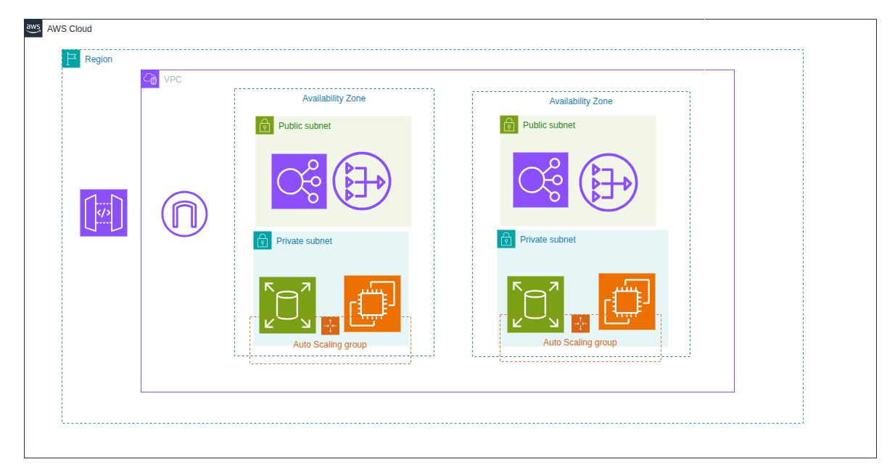

# Arquitetura AWS — Esboço Inicial



## Visão Geral

Este documento descreve a arquitetura AWS modelada como primeiro exercício de design arquitetônico na nuvem. O objetivo foi entender como os principais componentes de infraestrutura se relacionam e se posicionam corretamente dentro da hierarquia da AWS, priorizando o máximo de controle sobre os recursos — ou seja, preferindo serviços não gerenciados onde possível.

A arquitetura resultante segue um padrão multi-AZ com separação clara entre camada pública e privada, escalonamento automático e banco de dados sob controle total da aplicação.

---

## Hierarquia de Blocos

A AWS organiza seus recursos em camadas aninhadas. Entender essa hierarquia é o ponto de partida para qualquer diagrama arquitetônico:

```
AWS Cloud
└── Region
    └── VPC
        ├── Availability Zone A
        │   ├── Public Subnet
        │   └── Private Subnet
        └── Availability Zone B
            ├── Public Subnet
            └── Private Subnet
```

Cada camada tem um papel específico e os recursos precisam ser posicionados na camada correta para funcionar como esperado.

---

## Recursos Utilizados

### Internet Gateway (IGW)

**O que é:** o ponto de entrada e saída da VPC para a internet pública. É um recurso que se anexa à VPC e funciona como a porta de comunicação entre o mundo externo e os recursos internos.

**Motivação:** sem o IGW, nenhum tráfego externo consegue entrar na VPC, e nenhum recurso interno consegue alcançar a internet diretamente. Ele é o primeiro elo da cadeia de entrada.

**Posicionamento:** na borda da VPC, dentro do bloco Region.

---

### API Gateway

**O que é:** serviço gerenciado da AWS que expõe APIs HTTP/REST para o mundo externo. É um serviço regional — ele não vive dentro de uma subnet da VPC.

**Motivação:** centralizar o ponto de entrada das requisições da aplicação, desacoplando o cliente do backend. O API Gateway recebe as chamadas externas e as roteia para o Load Balancer dentro da VPC.

**Posicionamento:** dentro do bloco Region, fora do bloco VPC. Fica entre o Internet Gateway e o Application Load Balancer no fluxo de requisições.

---

### Application Load Balancer (ALB)

**O que é:** distribui o tráfego de entrada entre as instâncias EC2 disponíveis nas private subnets, com base em regras configuráveis (path, header, etc).

**Motivação:** garantir alta disponibilidade e distribuição de carga entre as instâncias nas duas AZs. Se uma instância cair, o ALB direciona o tráfego para as instâncias saudáveis automaticamente.

**Posicionamento:** dentro das public subnets, uma por Availability Zone. O ALB precisa estar nas subnets públicas porque precisa receber tráfego externo vindo do API Gateway.

---

### NAT Gateway

**O que é:** permite que recursos dentro das private subnets façam requisições de saída para a internet (para baixar pacotes, atualizações, chamar APIs externas), sem expor esses recursos diretamente à internet.

**Motivação:** os EC2s estão nas private subnets por segurança — eles não devem ser acessíveis diretamente pela internet. Porém, ainda precisam de acesso de saída. O NAT Gateway resolve isso: ele recebe as requisições de saída dos EC2s, as encaminha para a internet usando o IGW, e devolve a resposta — sem nunca expor o IP privado do EC2.

**Posicionamento:** dentro das public subnets, uma por Availability Zone. Precisa estar na public subnet porque depende de uma rota para o Internet Gateway.

---

### EC2 (Elastic Compute Cloud)

**O que é:** instâncias de máquinas virtuais onde a aplicação roda. Nesta arquitetura, optou-se por EC2 em vez de serviços gerenciados como ECS ou Lambda, para manter controle total sobre o ambiente de execução.

**Motivação:** controle completo sobre o sistema operacional, configurações de runtime, versões de software e comportamento da instância. É a abordagem não gerenciada, coerente com o objetivo deste exercício.

**Posicionamento:** dentro das private subnets, protegidos da internet direta. O tráfego chega até eles apenas via ALB.

---

### EBS (Elastic Block Store)

**O que é:** volume de disco persistente anexado a uma instância EC2. Funciona como o HD da máquina virtual — os dados gravados nele persistem mesmo se a instância for reiniciada.

**Motivação:** nesta arquitetura, o EBS é usado para hospedar o banco de dados diretamente na instância EC2. Isso elimina a dependência de um serviço gerenciado como o RDS, mantendo controle total sobre a instalação, configuração, versão e tuning do banco de dados. A contrapartida é que backups, replicação e failover do banco precisam ser gerenciados manualmente.

**Posicionamento:** acoplado ao EC2 — o EBS não é um serviço independente, é um volume anexado à instância. No diagrama, é representado junto ao ícone do EC2, dentro do Auto Scaling Group.

---

### Auto Scaling Group (ASG)

**O que é:** política que monitora as instâncias EC2 e automaticamente adiciona ou remove instâncias com base em métricas definidas (CPU, memória, número de requisições, etc).

**Motivação:** garantir que a aplicação escale horizontalmente conforme a demanda, sem intervenção manual. Se o tráfego aumentar, o ASG sobe novas instâncias. Se cair, ele termina as instâncias desnecessárias, otimizando custo.

**Posicionamento:** é representado como um contêiner (retângulo tracejado) ao redor das instâncias EC2 nas private subnets. Não é um recurso que ocupa uma posição física na subnet — ele é uma política que envolve os recursos que gerencia.

---

## Fluxo de uma Requisição

```
Cliente (internet)
      ↓
Internet Gateway  →  entrada na VPC
      ↓
API Gateway  →  roteamento e controle de acesso à API
      ↓
Application Load Balancer  →  distribuição entre AZs
      ↓
EC2 (private subnet)  →  processamento da aplicação
      ↓
EBS (acoplado ao EC2)  →  banco de dados
```

Para tráfego de saída dos EC2s (atualizações, chamadas a APIs externas):

```
EC2 (private subnet)
      ↓
NAT Gateway (public subnet)
      ↓
Internet Gateway
      ↓
Internet
```

---

## Por que Multi-AZ?

Usar duas Availability Zones é o padrão mínimo para alta disponibilidade na AWS. Uma AZ é essencialmente um datacenter isolado dentro de uma Region. Se uma AZ sofrer uma falha (energia, rede, hardware), a outra continua operando normalmente.

Nesta arquitetura, cada AZ tem sua própria public subnet (com ALB node e NAT Gateway) e sua própria private subnet (com EC2 + EBS dentro do ASG). Isso significa que uma falha completa de uma AZ não derruba a aplicação.

---

## Próximos Passos — Controle de Segurança

A arquitetura atual define a estrutura de rede e computação, mas ainda não endereça o controle de segurança. Os próximos elementos a modelar são:

**Security Groups**
São firewalls virtuais que controlam o tráfego de entrada e saída em nível de instância. Cada recurso (EC2, ALB, RDS) deve ter seu próprio Security Group com regras mínimas necessárias — por exemplo, o EC2 só deve aceitar tráfego vindo do ALB, não da internet diretamente.

**Network ACLs (NACLs)**
Complementam os Security Groups operando em nível de subnet. São stateless (diferente dos Security Groups, que são stateful) e permitem regras de deny explícitas. Úteis para bloquear faixas de IP inteiras na borda da subnet.

**IAM Roles e Policies**
Definem quais serviços e usuários podem fazer o quê dentro da conta AWS. As instâncias EC2 devem ter IAM Roles com permissões mínimas necessárias (princípio do least privilege), em vez de credenciais hardcoded.

**AWS WAF (Web Application Firewall)**
Pode ser anexado ao API Gateway ou ao ALB para filtrar tráfego malicioso — SQL injection, XSS, rate limiting por IP, bloqueio geográfico.

**VPC Flow Logs**
Registram todo o tráfego de rede dentro da VPC, essenciais para auditoria e detecção de anomalias.

**AWS Shield**
Proteção contra ataques DDoS, integrada nativamente ao API Gateway e ao ALB.

---

## Conclusão

Este esboço cobre os fundamentos de uma arquitetura AWS: isolamento de rede, alta disponibilidade, escalonamento automático e controle sobre o ambiente de execução.